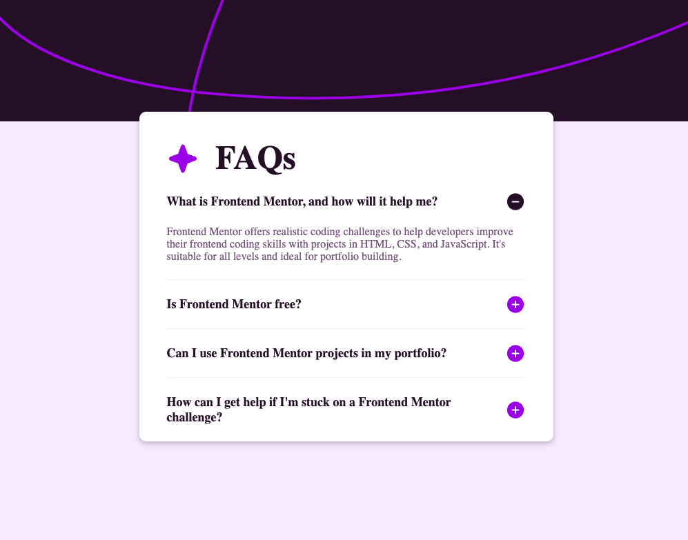

# Frontend Mentor - FAQ accordion

This is a solution to [FAQ accordion](https://www.frontendmentor.io/challenges/faq-accordion-wyfFdeBwBz) on Frontend Mentor.

## The challenge

Users should be able to:

- Hide/Show the answer to a question when the question is clicked
- Navigate the questions and hide/show answers using keyboard navigation alone
- View the optimal layout for the interface depending on their device's screen size
- See hover and focus states for all interactive elements on the page

## Built with

- HTML
- JavaScript
- CSS

## Links

- [Solution](https://github.com/LandonRGeorge/fem-faq-accordion)
- [Live Site](https://landonrgeorge.github.io/fem-faq-accordion/)
